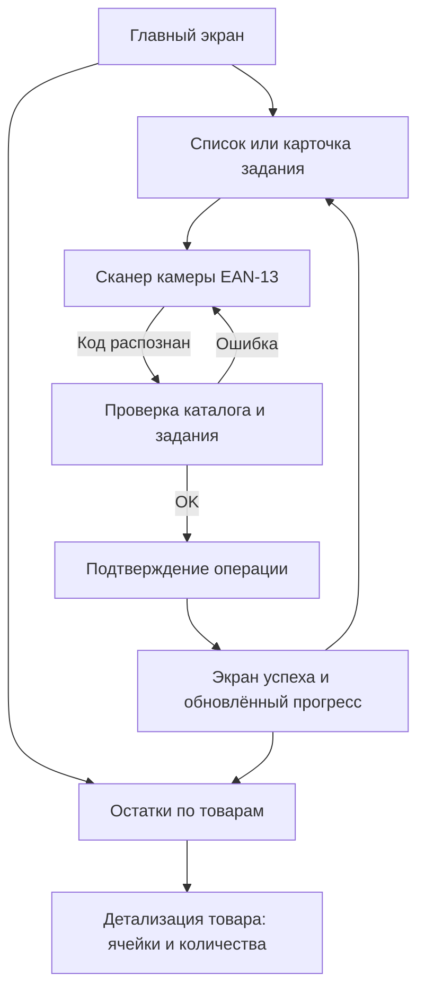
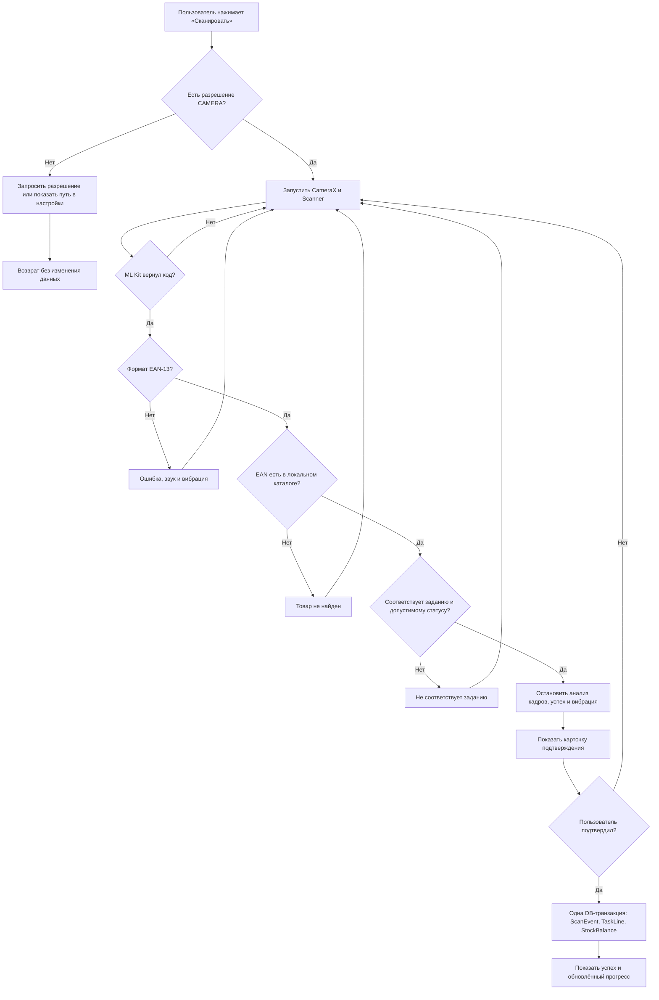

# Мини-ТЗ: MVP «ТСД ЛЭТУАЛЬ»

**Версия:** 1.0 · **Цель:** хакатон · **Статус:** готово к реализации

## 1. Зачем создаётся MVP

MVP — это офлайн-прототип мобильного рабочего места сотрудника склада/магазина ЛЭТУАЛЬ на Android. Он не подключается к корпоративным системам, но убедительно имитирует их часть: каталог товаров, складскую структуру, задания и изменения остатков заранее загружены локально.

За две минуты жюри должно пройти большую часть продукта: открыть операции, отсканировать товар камерой, подтвердить действие, увидеть движение товара и проверить итоговые остатки по ячейкам. Приложение должно демонстрировать, что миграцию Xamarin-легаси можно выполнить на нативный Java Android с архитектурой, готовой к подключению Zebra/Movfast в будущем.

### Граница MVP

В MVP входят три операции: **приёмка, размещение и пополнение**, а также просмотр остатков и мест хранения.

Не входят: авторизация, сеть, настоящий обмен с ERP/WMS, облачная синхронизация, аппаратный Zebra DataWedge и реальная многопользовательская работа. Это сознательные ограничения демо-версии, а не архитектурный тупик.

## 2. Участник и демонстрационный контекст

**Роль пользователя:** кладовщик магазина «ЛЭТУАЛЬ ТЦ Европейский». В шапке всегда показаны: магазин, склад «Основной», режим «Офлайн», дата и имя условного сотрудника «Анна Смирнова».

**Складская структура:**

```
Магазин «ЛЭТУАЛЬ ТЦ Европейский»
└── Склад «Основной»
    ├── Зона ПРИЁМКА
    │   └── ПР-01
    ├── Зона A · стеллаж 01
    │   ├── A-01-01
    │   └── A-01-02
    └── Торговый зал · секция Парфюмерия
        └── ЗАЛ-P-01
```

**Демо-данные:** 5–8 косметических товаров с реальными по формату EAN-13, фотографиями-заглушками, артикулами, ожидаемыми количествами и начальными остатками. Минимум три ячейки должны иметь остатки, одна — быть пустой. Все названия, сотрудники и количества вымышлены.

> Допущение по умолчанию: показываем вымышленный бренд и товары либо общеизвестные марки без логотипов. Это безопаснее для публичной демонстрации и не создаёт впечатления, что приложение подключено к реальному контуру ЛЭТУАЛЬ.

## 3. Главный сценарий презентации (до 2 минут)

1. На стартовом экране жюри видит четыре операции, карту текущего контекста и кнопку «Остатки».
2. Открывает **Приёмку № PRM-2409**: видит поставку и одну ожидаемую позицию. Нажимает «Сканировать», наводит камеру на тестовую этикетку EAN-13, получает карточку товара и подтверждает приём.
3. Возвращается и открывает **Размещение № RAZ-101**: выбирает предложенную ячейку `A-01-02`, сканирует тот же товар и подтверждает перемещение из `ПР-01`.
4. Открывает **Пополнение № POP-054**: видит, откуда и куда нужно перенести товар, подтверждает одно перемещение.
5. Нажимает **Остатки**: в таблице видны товар, суммарный остаток и список ячеек. Товар из выполненных операций уже отражён в новых местах хранения.

Одна операция выполняется за 15–25 секунд. Для каждого задания оставляется только одна обязательная строка и не более одного подтверждения — это не «упрощение логики», а темп презентации.

### Как обеспечить настоящее сканирование

На столе команды должны лежать 2–3 распечатанные тестовые этикетки EAN-13 из seed-данных. Основной сценарий использует **только камеру**; код вручную не вводится. Карточки с кодами можно также вывести на втором телефоне.

> Допущение по умолчанию: экран сканирования имеет только камеру и кнопку «Отмена». Если на защите не будет физической этикетки, разрешается добавить отдельный режим разработчика «Демо-скан» с выбором заранее известных кодов, скрытый из обычного сценария. Он не заменяет камеру и должен быть явно подписан как эмуляция.

## 4. Функциональные требования

### 4.1. Стартовый экран

Экран — операционная панель, а не просто меню:

- контекст работы: магазин → склад, зелёный статус «Локальные данные»;
- три крупные карточки: Приёмка, Размещение, Пополнение;
- на каждой карточке: иконка, число активных заданий и короткий статус;
- отдельная крупная кнопка «Остатки по товарам»;
- кнопки рассчитаны на палец: высота не меньше 56 dp, контрастные цвета, текст не мельче 16 sp.

### 4.2. Общий паттерн операции

Каждая операция открывается как предзаполненное задание. В нём показаны номер, статус, откуда/куда движется товар, прогресс и одна или несколько строк товара. Пользователь проходит одинаковый понятный цикл: открыть задание → считать EAN-13 → увидеть результат → подтвердить → увидеть успех и обновлённый прогресс.

После подтверждения приложение создаёт локальное событие сканирования и локально изменяет остаток/статус задания. Повторное открытие экрана должно показывать новое состояние без перезапуска приложения.

### 4.3. Приёмка

**Вход:** поставка `PRM-2409`, зона приёмки `ПР-01`, ожидаемая строка товара и количество.

**Успех:** EAN найден, товар соответствует строке задания; пользователь видит название, артикул, ожидаемое и принятое количество, затем нажимает «Подтвердить приёмку».

**Результат:** увеличивается остаток товара в `ПР-01`, строка и задание становятся «Выполнено».

### 4.4. Размещение

**Вход:** товар уже принят в `ПР-01`, задача предлагает ячейку назначения, например `A-01-02`.

**Действие:** пользователь открывает задание, видит источник и назначение, выбирает предложенную ячейку в списке/карточке, сканирует EAN-13, подтверждает.

**Результат:** количество уменьшается в `ПР-01` и увеличивается в ячейке назначения. Экран успеха явно показывает маршрут `ПР-01 → A-01-02`.

### 4.5. Пополнение

**Вход:** задание на перенос товара из складской ячейки в ячейку торгового зала (`A-01-01 → ЗАЛ-P-01`).

**Действие и результат:** сканирование подтверждает нужный товар; после подтверждения остаток перемещается между ячейками, задача получает статус «Выполнено».

### 4.6. Остатки по товарам («локальный Excel»)

Это табличный экран отчётности, а не реальный экспорт в файл:

- поиск по названию, артикулу или EAN-13;
- строка товара: название, артикул, EAN-13, суммарный остаток, число ячеек;
- нажатие открывает детализацию: все ячейки, адрес, зона и количество в каждой;
- визуальный стиль таблицы: заголовок, строки, разделители, сортировка по названию или количеству;
- на экране обязаны быть уже видны результаты выполненных операций.

> Допущение по умолчанию: это **внутреннее табличное представление**, без генерации `.xlsx` и без Android Share Sheet. Настоящий Excel-экспорт не нужен для доказательства процесса и опасен по срокам.

### 4.7. Сканирование и обработка ошибок

Сканер принимает только EAN-13. При первом допустимом результате камера останавливается, код нормализуется, после чего открывается экран/нижняя панель подтверждения.

| Ситуация | Поведение |
| --- | --- |
| Код EAN-13 найден и соответствует заданию | Зелёный результат, короткий звук и вибрация, переход к подтверждению. |
| Код имеет другой формат | Красное сообщение «Нужен штрихкод EAN‑13», камера продолжает работу. |
| EAN-13 отсутствует в каталоге | Красное сообщение «Товар не найден в локальном каталоге», камера продолжает работу. |
| Товар не соответствует текущему заданию | Янтарное сообщение с названием ожидаемого товара; остатки не меняются. |
| Камера недоступна/разрешение отклонено | Понятный экран с кнопкой перехода в настройки Android; данные не теряются. |
| Один кадр прочитан несколько раз | Debounce: после первого успеха обработка блокируется до ответа пользователя. |

Успешное и ошибочное действие сопровождаются разными короткими звуками и виброоткликом. Звук не должен быть единственным индикатором результата.

## 5. Экранная карта



### Обязательные экраны

| ID | Экран | Назначение |
| --- | --- | --- |
| S01 | Главная | Контекст, 4 операции, быстрый переход к остаткам. |
| S02 | Список заданий | Активные и выполненные задания выбранного типа. Допускается объединить с S03 при одном задании. |
| S03 | Карточка задания | Маршрут, позиции, количества, прогресс, старт сканирования. |
| S04 | Сканер | CameraX Preview, рамка, подсказка, «Отмена». |
| S05 | Подтверждение | Найденный товар и данные операции; «Подтвердить»/«Сканировать снова». |
| S06 | Успех | Маршрут/итог, прогресс, возврат к заданию или остаткам. |
| S07 | Остатки | Поиск и табличный список товаров. |
| S08 | Карточка товара | Все местоположения и количества выбранного товара. |

## 6. Блок-схема «сканирование и обработка результата»



## 7. Локальная БД

Хранилище — Room поверх SQLite. Данные полностью живут на устройстве. При первом запуске БД наполняется seed-данными; затем операции меняют только локальное состояние.

### Сущности

| Таблица | Основные поля | Назначение |
| --- | --- | --- |
| `products` | `id`, `sku`, `ean13` (unique), `name`, `brand`, `category`, `imageResName` | Каталог демонстрационных товаров. |
| `warehouses` | `id`, `storeName`, `name` | Контекст магазина и склада. |
| `storage_cells` | `id`, `warehouseId`, `code` (unique), `zone`, `address`, `type` | Зоны, ячейки приёмки, склада и торгового зала. |
| `stock_balances` | `id`, `productId`, `cellId`, `quantity`, `updatedAt` | Остаток конкретного товара в конкретной ячейке. Уникальность пары (`productId`, `cellId`). |
| `operation_tasks` | `id`, `number`, `type`, `status`, `sourceCellId`, `targetCellId`, `title`, `createdAt`, `completedAt` | Преднастроенные задания приёмки, размещения и пополнения. |
| `operation_lines` | `id`, `taskId`, `productId`, `plannedQty`, `actualQty`, `status` | Товар и прогресс в задании. |
| `scan_events` | `id`, `taskId`, `productId`, `ean13`, `result`, `scannedAt` | Аудит каждого удачного/неудачного сканирования. |

Связи: `warehouse 1—N storage_cells`; `product N—N storage_cells` через `stock_balances`; `operation_task 1—N operation_lines`; `product 1—N scan_events`.

### Ключевые правила целостности

- EAN — ровно 13 цифр и уникален в `products`.
- `quantity`, `plannedQty`, `actualQty` неотрицательны.
- Остаток перемещается одной транзакцией: списание из источника и зачисление в назначение происходят вместе.
- Отсканированный товар меняет остаток только после явного подтверждения пользователем.
- Задача становится `COMPLETED`, когда все её строки завершены.

> Допущение по умолчанию: один товар может находиться в нескольких ячейках. Это лучше соответствует реальному складу, чем текущая идея «одно место — один товар», и позволяет убедительно показать отчёт по местам хранения.

## 8. Архитектура и стек

### Технологический стек

| Слой | Выбор для MVP | Зачем |
| --- | --- | --- |
| Платформа | Java 11, Android minSdk 26 (8.0), targetSdk 34 (14) | Условия кейса и поддержка ТСД. |
| UI | Android Views, Material Components, ViewBinding | Быстро реализуется на Java, подходит для крупных TСД-интерфейсов. |
| Камера | CameraX | Единый предсказуемый API камеры на телефонах и ТСД. |
| Распознавание | ML Kit Barcode Scanning **bundled**, только `FORMAT_EAN_13` | Офлайн-сканирование без загрузки модели. |
| Локальные данные | Room / SQLite | Переживает перезапуск приложения, даёт прозрачную схему данных. |
| Асинхронность | `ExecutorService` + главный поток | Не добавляет Kotlin/Coroutine в Java-проект. |
| Тесты | JUnit 4 для бизнес-правил, Espresso — только smoke-навигация при наличии времени | Упор на проверяемую логику за короткий срок. |

### Обязательные границы кода

```
app (Activities, ViewBinding, навигация)
 ├── domain (OperationService, правила операций, модели результата)
 ├── data (Room entities/DAO, repositories, seed-данные)
 └── scanner (контракт только со Scanner-модулем)

:scanner (отдельный Gradle-модуль)
 ├── BarcodeScanner — интерфейс
 ├── ScanResult / ScanError — нейтральные модели
 └── MlKitBarcodeScanner — реализация CameraX + ML Kit
```

Контракт сканера не возвращает классы ML Kit в бизнес-логику. Например:

```java
public interface BarcodeScanner {
    void start(ScanListener listener);
    void stop();
}
```

В будущем вместо `MlKitBarcodeScanner` добавляется адаптер `ZebraDataWedgeScanner` или `MovfastScanner`; `OperationService` и UI обработки результата не переписываются.

> Допущение по умолчанию для часа разработки: если выделение Gradle-модуля замедляет сборку, сначала оставить контракт и ML Kit-реализацию в изолированном пакете `scanner`, а перенос в `:scanner` выполнить вторым коротким коммитом. Нельзя связывать Activity напрямую с ML Kit.

## 9. Нефункциональные требования и критерии готовности

- Весь основной путь работает без сети; разрешение `INTERNET` не является необходимым.
- Камера запрашивается только при открытии сканера.
- Время от распознавания корректного EAN до карточки результата — визуально не более 1 секунды на тестовом устройстве.
- Интерфейс читаем на экране 5–6 дюймов: контрастный, без мелких кликабельных областей, поддерживает портретную ориентацию.
- Нет пустых/заглушечных экранов операций: каждая из четырёх операций приводит к изменению локальных данных.
- Перезапуск приложения не удаляет выполненные операции и остатки.
- При отказе в камере приложение не падает и позволяет вернуться назад.
- Проект собирается командой `./gradlew assembleDebug`; базовые unit-тесты проходят.

### Приёмка MVP

MVP готов, если демонстратор без объяснения внутреннего кода может:

1. Открыть каждую из четырёх операций и понять её назначение.
2. Камерой считать тестовый EAN-13 и увидеть корректный товар.
3. Получить понятную реакцию на неизвестный/неподходящий EAN.
4. Выполнить приёмку, размещение и пополнение.
5. На экране остатков увидеть суммарное количество и реальные ячейки размещения товара.
6. Перезапустить приложение и увидеть сохранённое состояние.
7. По структуре кода объяснить замену ML Kit на Zebra/DataWedge без изменений бизнес-логики.

## 10. Очерёдность реализации (60 минут)

| Время | Результат |
| --- | --- |
| 0–10 мин | Зафиксировать зависимости, модели, единый `BarcodeScanner`, seed-данные. |
| 10–25 мин | Главная, задания и единый экран/диалог подтверждения для четырёх операций. |
| 25–40 мин | CameraX + ML Kit EAN-13, разрешения, успех/ошибки, звук и вибрация. |
| 40–50 мин | Локальное изменение остатков, таблица «Остатки», детализация по ячейкам. |
| 50–60 мин | Сбросить критические баги, пройти сценарий презентации, проверить сборку. |

Если время заканчивается, не сокращать: офлайн-данные, общий контракт сканера, четыре карточки операций, обработку ошибок, экран остатков. Сокращать: анимации, фотографии товаров, сложные фильтры, Excel-файл и второстепенные настройки.
